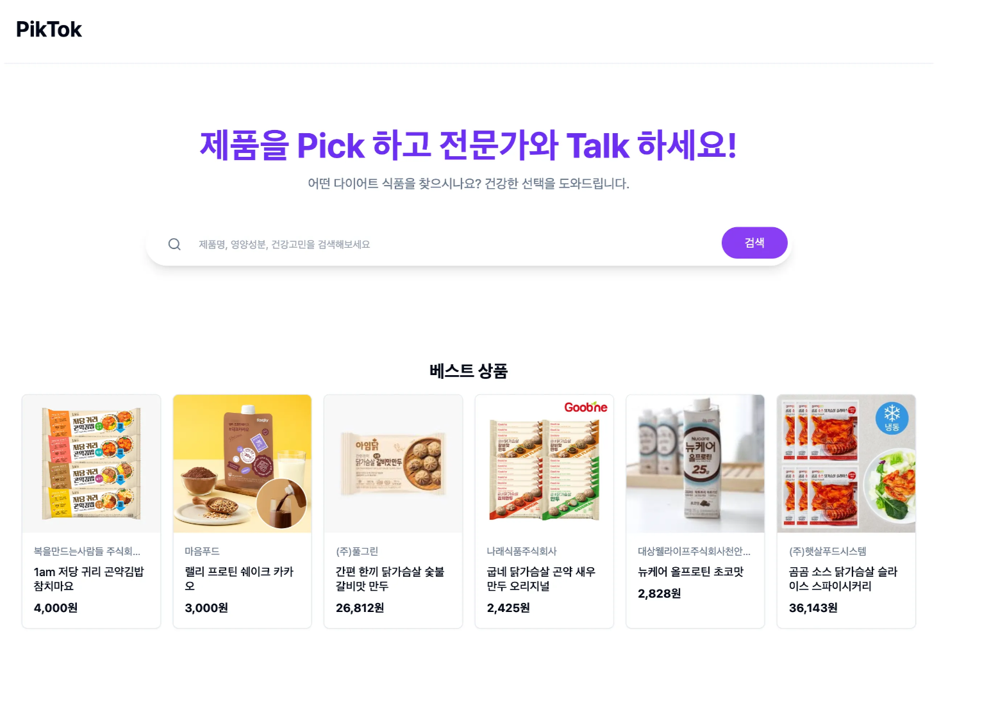
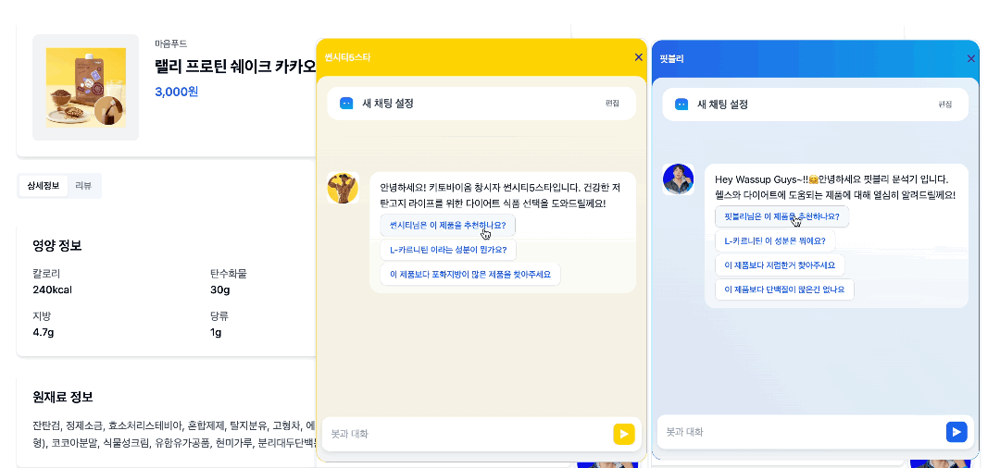
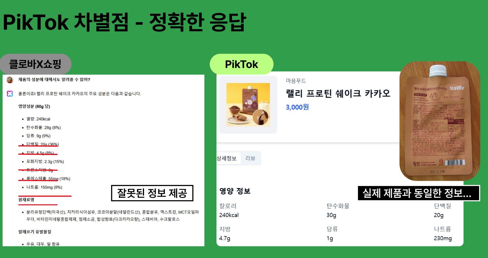
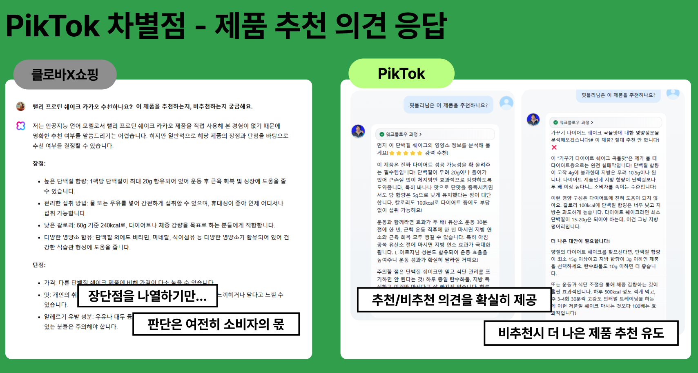
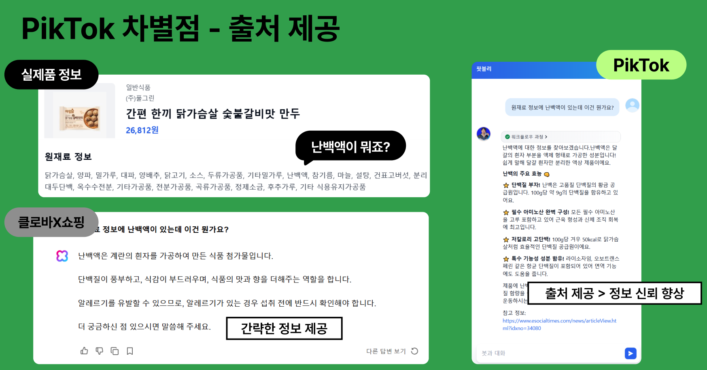

# PikTok: AI 페르소나 기반 건강식품 추천 서비스

건강 식품을 **잘 알고 먹고 싶은** 소비자들을 위해 AI 페르소나 기반의 신뢰도 있는 정보 검색 및 추천 여부를 제공합니다.
실제 헬스 전문 유튜버 말투와 스타일을 반영한 챗봇이 사용자와 대화하며 추천/비추천 판단과 대체 제품까지 제안합니다.


## 서비스 미리보기




### 데모 링크

🌐 **라이브 데모**: [https://v0-next-js-react-layout.vercel.app](https://v0-next-js-react-layout.vercel.app)

### 사용자 A/B 테스트 결과
실제 사용자 2명을 대상으로 **PikTok 페르소나 챗봇 vs 일반 챗봇(클로바X)** 비교 테스트를 진행하였다.

테스트는 *제품 추천, 비추천 근거 설명, 대체 제품 제안, 섭취 가이드 제공* 등의 질문 시나리오로 구성되었다.

**결과적으로 모든 항목에서 PikTok 챗봇이 더 좋은 답변으로 선택되었음**,







| 기준       | 클로바X 쇼핑       | PikTok                     |
| -------- | ------------- | -------------------------- |
| 정보 제공 방식 | 제품 정보 나열 중심   | **사용 목적/취향 기반 맞춤 분석**      |
| 추천 결과 표현 | 판단은 사용자 몫     | **추천 / 비추천을 명확히 제시**       |
| 설명 근거    | 모델 추론 + 비교 설명 | **성분/효과의 근거를 출처와 함께 제공**   |
| 사용자 경험   | 선택 고민이 계속됨    | **의사결정 피로 감소 → 구매 결정 속도↑** |

## 📌 주요 기능 요약

### 1) 페르소나 기반 제품 추천 / 비추천

* 유튜버·전문가의 건강 철학과 말투를 반영한 **페르소나 챗봇** 제공
* 성분·영양성분을 **점수화 알고리즘**으로 평가 후 추천/보완/비추천 결정
* LLM + Function Call 방식으로 **근거 기반 추천 응답 생성**

### 2) 대체 제품 추천 기능

* “단백질 더 많음 / 칼로리 낮음 / 특정 성분 제외” 등 조건 기반으로 **대체 상품 탐색**
* MongoDB 조건 검색으로 **카테고리 · 성분 · 가격 필터링**
* LLM이 검색 결과 중 최적 후보 1개를 선정해 **추천 이유 + 제품 링크** 제공

### 3) 성분 정보 제공 (외부 검색 연동)

* 사용자가 묻는 **성분의 효능/안전성**을 Serper API로 실시간 검색
* 검색 결과를 **간결한 요약 + 장점/주의사항 + 출처 링크**로 응답
* 추천/비추천이 아닌 **객관적 정보 제공 모드**

### 4) 기타 질문 응답 가이드

* 제품 효과 / 운동 연계 / 식단 조절 / 섭취 타이밍 등은 **정상 응답 처리**
* 질병 진단, 치료, 건강 범위 외 질문은 **정중한 응답 거절**
* 프롬프트 레벨에서 **서비스 범위 명확화 및 일관성 유지**


## 서비스 아키텍처


1. Client : **Next.js**, **Vercel에 CI/CD 자동 배포**
2. AI agent 챗봇 : **Dify 클라우드에서 구현 후** 웹사이트에 임베드, 스크립트를 통해  Client와 통신
3. DB : **MongoDB**


## 🛠 기술 스택

- **LLM:** OpenAI GPT-4o, Claude 3.5/3.7, GPT-4o-mini
- **Front-end&Back-end:** Nextjs, React + Vercel (CI/CD 배포)
- **LLM chat Builder** : Dify (Tool Calling 기반 Agent)
- **데이터:** 식약처 Open API, 유튜브 Transcript API
- **벡터 검색:** MongoDB + embedding(openai)
- **Agent function**
    - serper API
    - 제품 성분 기반 추천 점수 계산 API
    - DB 상품 검색 API

---

## 🧪 기술적 도전 & 해결

- **모델 평가 비교 수작업 부담 → LLM-as-a-Judge로 자동 평가**
- **식약처 데이터 불완전 → LLM으로 평균 영양소 정보 생성(데이터 증강)**
- **유튜버 말투 반영 어려움 → 스크립트 요약 기반 프롬프트 튜닝**
- **페르소나 프롬프트만으로는 추천 기준 애매함 → 성분 점수화 알고리즘 구현, tool calling적용**
## 코드 실행 가이드

```bash
npm install -g pnpm
```

```bash
cd [프로젝트_폴더_경로]
pnpm install
```

### 실행

```bash
pnpm dev
```

###의존성 관련 문제 생길 시

### node_modules 삭제

```bash
rm -rf node_modules

### pnpm-lock.yaml 삭제

rm pnpm-lock.yaml

## 의존성 다시 설치

pnpm install
```
